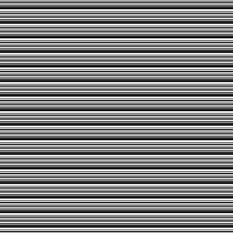

# Test helper library for Unity Test Framework

[](https://github.com/nowsprinting/test-helper/actions/workflows/metacheck.yml)
[](https://github.com/nowsprinting/test-helper/actions/workflows/test.yml)
[](https://openupm.com/packages/com.nowsprinting.test-helper/)
[](https://deepwiki.com/nowsprinting/test-helper)

Custom attributes, constraints, and comparers for writing more expressive tests in [Unity Test Framework](https://docs.unity3d.com/Packages/com.unity.test-framework@latest).  
Required Unity 2019 LTS or later.


## Features

### Attributes

#### BuildScene

`BuildSceneAttribute` is a NUnit test attribute class that build a scene before running the test on player.

This attribute has the following benefits:

- Scenes that are **NOT** in "Scenes in Build" can be specified.
- The scene file path can be specified as a relative path from the test class file.

This attribute can be placed on the test method, the test class (`TestFixture`), and the test assembly.
Can be used with sync `Test`, async `Test`, and `UnityTest`.

Usage:

```csharp
[TestFixture]
public class MyTestClass
{
    [Test]
    [BuildScene("Assets/Path/To/Tests/Scenes/TestScene.unity")]
    public void MyTestMethod()
    {
        // Setup before load scene

        // Load scene
        await SceneManagerHelper.LoadSceneAsync("Assets/Path/To/Tests/Scenes/TestScene.unity");

        // Excercise the test
    }

    [Test]
    [BuildScene("../../Scenes/SampleScene.unity")]
    public void UsingRelativePath()
    {
        // snip
    }
}
```

> [!NOTE]  
> If you want to load the scene before the test, use [LoadSceneAttribute](#loadscene) instead.


#### CreateScene

`CreateSceneAttribute` is an NUnit test attribute class to create a new scene and activate it before running the test.

This attribute has the following benefits:

- Can use the same code for running Edit Mode tests, Play Mode tests in Editor, and on Player

This attribute can be placed on the test method only.
Can be used with sync `Test`, async `Test`, and `UnityTest`.

Usage:

```csharp
[TestFixture]
public class MyTestClass
{
    [Test]
    [CreateScene(camera: true, light: true)]
    public void MyTestMethod()
    {
        var camera = GameObject.Find("Main Camera");
        Assert.That(camera, Is.Not.Null);

        var light = GameObject.Find("Directional Light");
        Assert.That(light, Is.Not.Null);
    }
}
```

> [!TIP]  
> If you want to unload other scenes, specify the `unloadOthers` option.

> [!NOTE]  
> This process runs after `OneTimeSetUp` and before `SetUp`

> [!NOTE]  
> Create or not `Main Camera` and `Directional Light` can be specified with parameters (default is not create)


#### FocusGameView

`FocusGameViewAttribute` is an NUnit test attribute class to focus `GameView` or `SimulatorWindow` before running the test.

This attribute can be placed on the test method, the test class (`TestFixture`), and the test assembly.
Can be used with sync `Test`, async `Test`, and `UnityTest`.

Usage:

```csharp
[TestFixture]
public class MyTestClass
{
    [Test]
    [FocusGameView]
    public void MyTestMethod()
    {
        // e.g., Test using InputEventTrace of Input System package.
    }
}
```

> [!NOTE]  
> In batchmode, open `GameView` window.


#### GameViewResolution

`GameViewResolutionAttribute` is an NUnit test attribute class to set custom resolution to `GameView` before running the test.

This attribute can be placed on the test method, the test class (`TestFixture`), and the test assembly.
Can be used with async `Test` and `UnityTest`.

Usage:

```csharp
[TestFixture]
public class MyTestClass
{
    [UnityTest]
    [GameViewResolution(640, 480, "VGA")]
    public IEnumerator MyTestMethod()
    {
        yield return null; // Wait for one frame to apply resolution.

        // e.g., Test using GraphicRaycaster.
    }
}
```

> [!IMPORTANT]  
> Wait for one frame to apply resolution.
> However, if used with [CreateSceneAttribute](#createscene) or [LoadSceneAttribute](#loadscene), wait is not necessary.

> [!NOTE]  
> In batchmode, open `GameView` window.


#### GizmosShowOnGameView

`GizmosShowOnGameViewAttribute` is an NUnit test attribute class to show/hide Gizmos on `GameView` during the test running.

This attribute can be placed on the test method only.
Can be used with sync `Test`, async `Test`, and `UnityTest`.

Usage:

```csharp
[TestFixture]
public class MyTestClass
{
    [Test]
    [GizmosShowOnGameView(true)]
    public void MyTestMethod()
    {
        // Show Gizmos on GameView during the test running.
    }
}
```

> [!NOTE]  
> In batchmode, open `GameView` window.


#### IgnoreBatchMode

`IgnoreBatchModeAttribute` is an NUnit test attribute class to skip the test execution when run tests with `-batchmode` from the commandline.

This attribute can be placed on the test method, the test class (`TestFixture`), and the test assembly.
Can be used with sync `Test`, async `Test`, and `UnityTest`.

Usage:

```csharp
[TestFixture]
public class MyTestClass
{
    [UnityTest]
    [IgnoreBatchMode("Using WaitForEndOfFrame.")]
    public IEnumerator MyTestMethod()
    {
        // e.g., Test needs to take a screenshot.

        yield return new WaitForEndOfFrame();
        ImageAssert.AreEqual(expectedTexture, Camera.main, settings);
    }
}
```


#### IgnoreWindowMode

`IgnoreWindowModeAttribute` is an NUnit test attribute class to skip the test execution when run tests on Unity editor window.

This attribute can be placed on the test method, the test class (`TestFixture`), and the test assembly.
Can be used with sync `Test`, async `Test`, and `UnityTest`.

Usage:

```csharp
[TestFixture]
public class MyTestClass
{
    [Test]
    [IgnoreWindowMode("Requires command line arguments")]
    public void MyTestMethod()
    {
        var args = Environment.GetCommandLineArgs();
        Assert.That(args, Does.Contain("-arg1"));
    }
}
```


#### LoadAsset

`LoadAssetAttribute` is a NUnit test attribute class that loads an asset file at the specified path into the field before running the test.

This attribute has the following benefits:

- The same code can be used for Edit Mode tests and Play Mode tests in Editor and on Player.
- The asset file path can be specified as a relative path from the test class file.

This attribute can be placed on the field only.

Usage:

```csharp
[TestFixture]
public class MyTestClass
{
    [LoadAsset("Assets/Path/To/Tests/Prefabs/Cube.prefab")]
    private GameObject _prefab;

    [LoadAsset("../../Prefabs/Sphere.prefab")]
    private GameObject _relative;

    [OneTimeSetUp]
    public void OneTimeSetUp()
    {
        LoadAssetAttribute.LoadAssets(this);    // Must call this method to load assets.
    }

    [Test]
    public void MyTestMethod()
    {
        Assume.That(_prefab, Is.Not.Null);  // Already loaded and set to the field.
    }
}
```

> [!IMPORTANT]  
> Tests that use this attribute must call the `LoadAssets` static method from the `OneTimeSetUp`.

> [!NOTE]  
> Properties are not supported. You can place attributes in fields by specifying `[field: LoadAsset]`.

> [!NOTE]  
> The Resources folder copied to run tests on the player is deleted after the run finishes.
> However, if post-processing is not performed, such as if the Unity editor crashes, the "Assets/com.nowsprinting.test-helper/Resources" folder will remain.
> Recommend adding "/Assets/com.nowsprinting.test-helper*" to your project .gitignore file.

> [!NOTE]  
> Loads asset with `AssetDatabase.LoadAssetAtPath(string,Type)` in the editor, and `Resources.Load(string,Type)` on the player.
> Asset settings such as image format will conform to the .meta file.


#### LoadScene

`LoadSceneAttribute` is a NUnit test attribute class that loads a scene before running the test.

This attribute has the following benefits:

- The same code can be used for Edit Mode tests and Play Mode tests in Editor and on Player.
- Scenes that are **NOT** in "Scenes in Build" can be specified.
- The scene file path can be specified as a relative path from the test class file.

This attribute can be placed on the test method only.
Can be used with sync `Test`, async `Test`, and `UnityTest`.

Usage:

```csharp
[TestFixture]
public class MyTestClass
{
    [Test]
    [LoadScene("Assets/Path/To/Tests/Scenes/TestScene.unity")]
    public void MyTestMethod()
    {
        var cube = GameObject.Find("Cube in TestScene");
        Assert.That(cube, Is.Not.Null);
    }

    [Test]
    [LoadScene("../../Scenes/SampleScene.unity")]
    public void UsingRelativePath()
    {
        // snip
    }
}
```

> [!NOTE]  
> This process runs after `OneTimeSetUp` and before `SetUp`.
> If you want to load during `SetUp` and testing, use [BuildSceneAttribute](#buildscene) and [SceneManagerHelper](#scenemanagerhelper) method instead.

> [!NOTE]  
> If you use the Raycaster in your tests, you must delay one frame after loading the scene.


#### RecordVideo (optional)

`RecordVideoAttribute` is an NUnit test attribute class for recording a video while running the test.

Default save path is "`Application.persistentDataPath`/TestHelper/Screenshots/`TestContext.Test.Name`.mp4".
You can specify the save directory by arguments.
Directory can also be specified by command line argument `-testHelperScreenshotDirectory`.

This attribute can be placed on the test method only.
Can be used with sync `Test`, async `Test`, and `UnityTest`.

Usage:

```csharp
[TestFixture]
public class MyTestClass
{
    [Test]
    [RecordVideo]
    public void MyTestMethod()
    {
        // Recording a video while running the test.
    }
}
```

> [!IMPORTANT]  
> `RecordVideoAttribute` is an optional functionality. To use it, you need to install the [Instant Replay for Unity](https://github.com/CyberAgentGameEntertainment/InstantReplay) package v1.0.0 or newer separately via the Package Manager window.

> [!IMPORTANT]  
> `GameView` must be visible. Use [FocusGameViewAttribute](#focusgameview) or [GameViewResolutionAttribute](#gameviewresolution) if running on batchmode.

> [!IMPORTANT]  
> Do not place on Edit Mode tests.


#### TakeScreenshot

`TakeScreenshotAttribute` is an NUnit test attribute class to take a screenshot and save it to a file after running the test.

Default save path is "`Application.persistentDataPath`/TestHelper/Screenshots/`TestContext.Test.Name`.png".
You can specify the save directory and/or filename by arguments.
Directory can also be specified by command line argument `-testHelperScreenshotDirectory`.

This attribute can be placed on the test method only.
Can be used with sync `Test`, async `Test`, and `UnityTest`.

Usage:
    
```csharp
[TestFixture]
public class MyTestClass
{
    [Test]
    [TakeScreenshot]
    public void MyTestMethod()
    {
        // Take screenshot after running the test.
    }
}
```

> [!IMPORTANT]  
> `GameView` must be visible. Use [FocusGameViewAttribute](#focusgameview) or [GameViewResolutionAttribute](#gameviewresolution) if running on batchmode.

> [!IMPORTANT]  
> Do not place on Edit Mode tests.

> [!NOTE]  
> If you want to take screenshots at any time, use the [ScreenshotHelper](#screenshothelper) class.

> [!NOTE]  
> When using MacOS with Metal Graphics API, the following warning appears at runtime. It seems that we should just ignore it.
> see: https://stackoverflow.com/questions/66062201/unity-warning-ignoring-depth-surface-load-action-as-it-is-memoryless
> - Ignoring depth surface load action as it is memoryless
> - Ignoring depth surface store action as it is memoryless


#### TimeScale

`TimeScaleAttribute` is an NUnit test attribute class to change the [Time.timeScale](https://docs.unity3d.com/ScriptReference/Time-timeScale.html) during the test running.

This attribute can be placed on the test method only.
Can be used with sync `Test`, async `Test`, and `UnityTest`.

Usage:

```csharp
[TestFixture]
public class MyTestClass
{
    [Test]
    [TimeScale(2.0f)]
    public void MyTestMethod()
    {
        // Running at 2x speed.
    }
}
```


#### UnityVersion

`UnityVersionAttribute` is an NUnit test attribute class to skip the test run if Unity version is older and/or newer than specified.

This attribute can be placed on the test method, the test class (`TestFixture`), and the test assembly.
Can be used with sync `Test`, async `Test`, and `UnityTest`.

Usage:

```csharp
[TestFixture]
public class MyTestClass
{
    [Test]
    [UnityVersion(newerThanOrEqual: "2022")]
    public void MyTestMethod()
    {
        // Test run only for Unity 2022.1.0f1 or newer (include specified version).
    }

    [Test]
    [UnityVersion(olderThan: "2019.4.0f1")]
    public void MyTestMethod()
    {
        // Test run only for Unity older than 2019.4.0f1 (exclude specified version).
    }
}
```


### Constraints

#### Destroyed

`DestroyedConstraint` tests that a `UnityEngine.Object` is destroyed.

Usage:

```csharp
using Is = TestHelper.Constraints.Is;

[TestFixture]
public class MyTestClass
{
    [Test]
    public void MyTestMethod()
    {
        var actual = GameObject.Find("Cube");
        GameObject.DestroyImmediate(actual);

        Assert.That(actual, Is.Destroyed);
    }
}
```

> [!NOTE]  
> When used with operators, use it in method style. e.g., `Is.Not.Destroyed()`


### Comparers

#### FlipTexture2dEqualityComparer (optional)

`FlipTexture2dEqualityComparer` is a NUnit test comparer class that compares two `Texture2D` using [FLIP](https://github.com/NVlabs/flip).

Output error map image file if assertion fails.
Default output path is "`Application.persistentDataPath`/TestHelper/Screenshots/`TestContext.Test.Name`.diff.png".
You can specify the output directory and/or filename by constructor arguments.
Directory can also be specified by command line argument `-testHelperScreenshotDirectory`.

Usage:

```csharp
[TestFixture]
public class MyTestClass
{
    [Test]
    public async Task MyTestMethod()
    {
        await Awaitable.EndOfFrameAsync();
        var actual = ScreenCapture.CaptureScreenshotAsTexture();
        var expected = AssetDatabase.LoadAssetAtPath<Texture2D>(ExpectedImagePath);

        var comparer = new FlipTexture2dEqualityComparer(meanErrorTolerance: 0.01f);
        Assert.That(actual, Is.EqualTo(expected).Using(comparer));
    }
}
```

> [!IMPORTANT]  
> `FlipTexture2dEqualityComparer` is an optional functionality. To use it, you need to install the [FlipBinding.CSharp](https://www.nuget.org/packages/FlipBinding.CSharp) NuGet package v1.0.0 or newer.
> Also, add scripting define symbol `ENABLE_FLIP_BINDING` if not installed via OpenUPM (UnityNuGet).

> [!NOTE]  
> When running on the Ubuntu 22.04 image (e.g., [GameCI](https://game.ci/) provided images), the GLIBCXX_3.4.32 (GCC 13+) required by FLIP's native libraries is missing.
> So, you will need to create a custom Docker image that includes libstdc++6 from GCC 13.

#### XmlComparer

`XmlComparer` is a NUnit test comparer class that compares two `string` as an XML document.

It only compares the attributes and values of each element in the document unordered.
XML declarations and comments are ignored, and white spaces, tabs, and newlines before and after the value are ignored.

Usage:

```csharp
[TestFixture]
public class MyTestClass
{
    [Test]
    public void MyTestMethod()
    {
        var actual = @"<root><child>value1</child><child attribute=""attr"">value2</child></root>";
        var expected = @"<?xml version=""1.0"" encoding=""utf-8""?>
<root>
  <!-- comment -->
  <child attribute=""attr"">
    value2
  </child>
  <!-- comment -->
  <child>
    value1
  </child>
</root>";

        Assert.That(actual, Is.EqualTo(expected).Using(new XmlComparer()));
    }
}
```


### Statistics APIs

`TestHelper.Statistics` namespace provides utilities for statistical testing, including assertions for pseudo-random number generators (PRNG) and statistical summary tools.

> [!IMPORTANT]  
> This feature is experimental.
> It is possible to make breaking changes without respecting SemVer.

> [!NOTE]  
> This feature is **NOT** statistical hypothesis testing tool.


#### Experiment

`Experiment` is a class for running experiments of PRNG.

Usage:

```csharp
[TestFixture]
public class MyStatisticsTest
{
    [Test]
    public void Experiment_2D6()
    {
        var sampleSpace = Experiment.Run(
            () => DiceGenerator.Roll(2, 6), // 2D6
            1 << 20); // 1,048,576 times

        Assert.That(sampleSpace.Max, Is.EqualTo(12));
        Assert.That(sampleSpace.Min, Is.EqualTo(2));
    }
}
```


#### DescriptiveStatistics

`DescriptiveStatistics` is a class for calculate statistical summaries and plotting a histogram.

Usage:

```csharp
[TestFixture]
public class MyStatisticsTest
{
    [Test]
    public void DescriptiveStatistics_2D6()
    {
        const int TrialCount = 1 << 20; // 1,048,576 times
        const double Tolerance = TrialCount * 0.001d;

        var sampleSpace = Experiment.Run(
            () => DiceGenerator.Roll(2, 6), // 2D6
            TrialCount);

        var statistics = new DescriptiveStatistics<int>();
        statistics.Calculate(sampleSpace);
        Debug.Log(statistics.GetSummary()); // Write to console

        Assert.That(statistics.PeakFrequency, Is.EqualTo(TrialCount / 6).Within(Tolerance));
        Assert.That(statistics.ValleyFrequency, Is.EqualTo(TrialCount / 36).Within(Tolerance));
        Assert.That(statistics.MedianFrequency, Is.EqualTo(TrialCount / 12).Within(Tolerance));
        Assert.That(statistics.MeanFrequency, Is.EqualTo(TrialCount / 11).Within(Tolerance));
    }
}
```

Console output example:

```
Experimental and Statistical Summary:
  Sample size: 1,048,576
  Maximum: 12
  Minimum: 2
  Peak frequency: 174,554
  Valley frequency: 29,070
  Median frequency: 87,490
  Mean frequency: 95,325.09
  Histogram: ▁▂▃▅▆█▆▅▃▂▁
  (Each bar represents the frequency of values in equally spaced bins.)
```


#### PixelPlot

`PixelPlot` is class that outputs a pixel plot image file.

Default save path is "`Application.persistentDataPath`/TestHelper/Statistics/`TestContext.Test.Name`.png".
You can specify the save directory and/or filename by arguments.
Directory can also be specified by command line argument `-testHelperStatisticsDirectory`.

Usage:

```csharp
[TestFixture]
public class MyStatisticsTest
{
    [Test]
    public void PixelPlot()
    {
        var sampleSpace = Experiment.Run(
            () => UnityEngine.Random.value,
            1 << 16); // 256x256

        var pixelPlot = new PixelPlot<float>();
        pixelPlot.Plot(sampleSpace);
        pixelPlot.WriteToFile("Path/To/Directory", "PixelPlot.png");
    }
}
```

Image output example;
Left: generated by strong PRNG,
Right: generated by weak (short period) PRNG:

<p>


</p>

> [!IMPORTANT]  
> Can plot only for samples with value type.


### Runtime APIs

The classes in the `TestHelper.RuntimeInternals` assembly can be used from the runtime code because it does not depend on `com.unity.test-framework`.

> [!TIP]  
> The "Define Constraints" is set to `UNITY_INCLUDE_TESTS || INCLUDE_COM_NOWSPRINTING_TEST_HELPER` in this assembly definition files, so it is generally excluded from release builds.
> To use the feature in release builds, add `INCLUDE_COM_NOWSPRINTING_TEST_HELPER` to the "Define Symbols" at build time.  
> How to set custom scripting symbols, see below:  
> [Manual: Custom scripting symbols](https://docs.unity3d.com/Manual/custom-scripting-symbols.html)


#### SceneManagerHelper

`SceneManagerHelper` is a utility class to load the scene file.

This method has the following benefits:

- The same code can be used for Edit Mode tests and Play Mode tests in Editor and on Player.
- The scene file path can be specified as a relative path from the test class file.

Usage:

```csharp
[TestFixture]
public class MyTestClass
{
    [Test]
    public void MyTestMethod()
    {
        // Setup before load scene

        // Load scene
        await SceneManagerHelper.LoadSceneAsync("Assets/Path/To/Tests/Scenes/TestScene.unity");

        // Excercise the test
    }

    [Test]
    public void UsingRelativePath()
    {
        // Setup before load scene

        // Load scene
        await SceneManagerHelper.LoadSceneAsync("../../Scenes/SampleScene.unity");

        // Excercise the test
    }
}
```

> [!TIP]  
> When loading the scene that is not in "Scenes in Build", use [BuildSceneAttribute](#buildscene).


#### ScreenshotHelper

`ScreenshotHelper` is a utility class to take a screenshot and save it to a file.

Default save path is "`Application.persistentDataPath`/TestHelper/Screenshots/`TestContext.Test.Name`.png".
(Replace `TestContext.Test.Name` to caller method name when called outside a test context.)
You can specify the save directory and/or filename by arguments.
Directory can also be specified by command line argument `-testHelperScreenshotDirectory`.

Usage:

```csharp
[TestFixture]
public class MyTestClass
{
    [UnityTest]
    public IEnumerator MyTestMethod()
    {
        yield return ScreenshotHelper.TakeScreenshot();
    }

    [Test]
    public async Task MyTestMethodAsync()
    {
        await ScreenshotHelper.TakeScreenshotAsync();   // Required Unity 2023.3 or newer
    }

    [Test]
    public async Task MyTestMethodAsync()
    {
        var coroutineRunner = new GameObject().AddComponent<CoroutineRunner>();
        await ScreenshotHelper.TakeScreenshot().ToUniTask(coroutineRunner); // Required UniTask package
    }

    private class CoroutineRunner : MonoBehaviour { }
}
```

> [!IMPORTANT]  
> `GameView` must be visible. Use [FocusGameViewAttribute](#focusgameview) or [GameViewResolutionAttribute](#gameviewresolution) if running on batchmode.

> [!IMPORTANT]  
> Do not place on Edit Mode tests.
> And must be called from main thread.

> [!TIP]  
> When using [UniTask](https://github.com/Cysharp/UniTask), you also need a coroutine-runner (any `MonoBehaviour` instance) because the `TakeScreenshot` method uses `WaitForEndOfFrame` internally.
> See more information: https://github.com/Cysharp/UniTask#ienumeratortounitask-limitation

> [!NOTE]  
> If you take multiple screenshots in one method, a counter is inserted to prevent overwriting.

> [!NOTE]  
> When using `TakeScreenshot` method on MacOS with Metal Graphics API, the following warning appears at runtime. It seems that we should just ignore it.
> see: https://stackoverflow.com/questions/66062201/unity-warning-ignoring-depth-surface-load-action-as-it-is-memoryless
> - Ignoring depth surface load action as it is memoryless
> - Ignoring depth surface store action as it is memoryless


#### PathHelper

The `PathHelper.CreateTemporaryFilePath` method provides utilities for creating a temporary file path in running tests.  
By default, the path is named by the test name in the directory pointed to by [Application.temporaryCachePath](https://docs.unity3d.com/ScriptReference/Application-temporaryCachePath.html).

Usage:

```csharp
namespace MyNamespace
{
  [TestFixture]
  public class MyTestClass
  {
    [Test]
    public void MyTestMethod()
    {
      var path = PathHelper.CreateTemporaryFilePath(extension: "txt");
      File.WriteAllText(path, "test file");
      // write to {Application.temporaryCachePath}/MyTestMethod.txt

      var path2 = PathHelper.CreateTemporaryFilePath(extension: "txt");
      File.WriteAllText(path2, "test file");
      // write to {Application.temporaryCachePath}/MyTestMethod_1.txt
    }

    [Test]
    public void MyTestMethod2()
    {
      var path = PathHelper.CreateTemporaryFilePath(namespaceToDirectory: true);
      File.WriteAllText(path, "test file");
      // write to {Application.temporaryCachePath}/MyNamespace/MyTestClass/MyTestMethod2
    }
  }
}
```


### Editor Extensions

#### Open Persistent Data Directory

Select menu item **Window > Test Helper > Open Persistent Data Directory**, which opens the directory pointed to by [Application.persistentDataPath](https://docs.unity3d.com/ScriptReference/Application-persistentDataPath.html) in the Finder/ File Explorer.


#### Open Temporary Cache Directory

Select menu item **Window > Test Helper > Open Temporary Cache Directory**, which opens the directory pointed to by [Application.temporaryCachePath](https://docs.unity3d.com/ScriptReference/Application-temporaryCachePath.html) in the Finder/ File Explorer.


### Commandline Arguments

#### JUnit XML format report

If you specify path with `-testHelperJUnitResults` command line option, the test result will be written in JUnit XML format when the tests are finished.

> [!NOTE]  
> The JUnit XML format is the so-called "Legacy." It does not support the "Open Test Reporting format" introduced in JUnit 5.

#### GameView resolution

If you specify display resolution standards (e.g., `VGA`) with the `-testHelperGameViewResolution` command line option, the GameView resolution is set to the specified size when starting the tests.

Or, you can specify width and height with `-testHelperGameViewWidth` and `-testHelperGameViewHeight` command line options.


## Installation

### 1. Install via Package Manager window

1. Open the Project Settings window (**Editor > Project Settings**) and select **Package Manager** tab (figure 1.)
2. Click **+** button under the **Scoped Registries** and enter the following settings:
    1. **Name:** `package.openupm.com`
    2. **URL:** `https://package.openupm.com`
    3. **Scope(s):** `com.nowsprinting`
3. Open the Package Manager window (**Window > Package Manager**) and select **My Registries** tab (figure 2.)
4. Select **Test Helper** and click the **Install** button

**Figure 1.** Scoped Registries setting in Project Settings window


**Figure 2.** My Registries in Package Manager window


### 2. Add assembly reference

1. Open your test assembly definition file (.asmdef) in the Inspector window
2. Add **TestHelper** into **Assembly Definition References**

> [!NOTE]  
> Add **TestHelper.RuntimeInternals** into **Assembly Definition References** if you use the [Runtime APIs](#runtime apis).


## License

MIT License


## How to contribute

Open an issue or create a pull request.

Be grateful if you could label the PR as `enhancement`, `bug`, `chore`, and `documentation`.
See [PR Labeler settings](.github/pr-labeler.yml) for automatically labeling from the branch name.


## How to development

### Clone repo as a embedded package

Clone this repository as a submodule under the Packages/ directory in your project.

```bash
git submodule add git@github.com:nowsprinting/test-helper.git Packages/com.nowsprinting.test-helper
```


### Run tests

Generate a temporary project and run tests on each Unity version from the command line.

```bash
make create_project
UNITY_VERSION=2019.4.40f1 make -k test
```

> [!IMPORTANT]  
> You must select "Input Manager (Old)" or "Both" in the **Project Settings > Player > Active Input Handling** for running tests.

> [!TIP]  
> To run all tests, you need to install the following packages in your project:
> - [UniTask](https://github.com/Cysharp/UniTask) package v2.3.3 or newer.
> - [FlipBinding.CSharp](https://www.nuget.org/packages/FlipBinding.CSharp) NuGet package v1.0.0 or newer.
> - [Instant Replay for Unity](https://github.com/CyberAgentGameEntertainment/InstantReplay) package v1.0.0 or newer


### Release workflow

The release process is as follows:

1. Run **Actions > Create release pull request > Run workflow**
2. Merge created pull request

Then, will do the release process automatically by [Release](.github/workflows/release.yml) workflow.
After tagging, [OpenUPM](https://openupm.com/) retrieves the tag and updates it.

> [!CAUTION]  
> Do **NOT** manually operation the following operations:
> - Create a release tag
> - Publish draft releases

> [!CAUTION]  
> You must modify the package name to publish a forked package.

> [!TIP]  
> If you want to specify the version number to be released, change the version number of the draft release before running the "Create release pull request" workflow.
